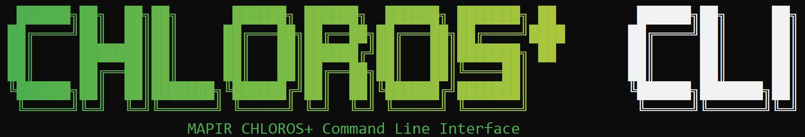

# CLI : บรรทัดคำสั่ง

> **คู่มืออ้างอิงครบถ้วน:**[CLI Reference](reference/cli-reference.md) อธิบาย**ทุกแฟล็กของทุกคำสั่งย่อย** และได้รับการปรับให้เหมาะสมสำหรับผู้ช่วย AI — วาง URL ลงในผู้ช่วยของคุณและขอคำสั่งที่ใช้งานได้: `https://mapir.gitbook.io/chloros/reference/cli-reference`
>
> **เคล็ดลับสำหรับเครื่องมือ AI:** หน้าใดก็ตามในคู่มือนี้สามารถเข้าถึงได้ในรูปแบบ Markdown ดิบ โดยการเพิ่ม `.md` ลงใน URL ของหน้านั้น (เช่น `https://mapir.gitbook.io/chloros/reference/cli-reference.md`), และ `https://mapir.gitbook.io/chloros/llms.txt` จะจัดทำดัชนีคู่มือทั้งหมดเพื่อใช้กับ LLM

<figure><figcaption></figcaption></figure>
<!-- SCREENSHOT-UPDATE: banner shows CLI 1.1.0; reshoot the CLI welcome/banner output on the 1.2.0 build so the version line reads "Chloros CLI 1.2.0" -->


##CLI
คืออะไร

`chloros-cli` เป็นส่วนหน้าบรรทัดคำสั่ง (command-line front end) ของเครื่องยนต์ประมวลผลเดียวกันที่แอปเดสก์ท็อปChloros
ใช้ มันเป็นไคลเอนต์แบบบาง (HTTP
) ที่ทำงานผ่านแบ็กเอนด์Chloros
(เซิร์ฟเวอร์ท้องถิ่นบน `127.0.0.1:5000`) — คำสั่งส่วนใหญ่จะเริ่มต้นแบ็กเอนด์โดยอัตโนมัติ ดังนั้นสคริปต์จึงต้องการเพียงการเรียก `chloros-cli process …` ครั้งเดียวเท่านั้น

มันทำงานได้บน **Windows
10/11 (x64)**และ**Linux
(x86_64, และ NVIDIA Jetson arm64 บน JetPack 6)** ในเทอร์มินัลใดก็ได้ โดยไม่จำเป็นต้องมี GUI ตรวจสอบการติดตั้งของคุณด้วย:

```bash
chloros-cli --version    # prints "Chloros CLI 1.2.0"
```

กลุ่มคำสั่งโดยสรุป:

* **การประมวลผลและบัญชี** — `process`, `login`, `logout`, `status`, `export-status`, `language` (38 ภาษา — ดู [ภาษาที่รองรับ](supported-languages.md)), `set-project-folder` / `get-project-folder` / `reset-project-folder`, `selftest`, `update` (เฉพาะLinux
/ Jetson)
* **ฮาร์ดแวร์แบบสด** — `lattice` (ควบคุมกล้อง LATTICE, คำสั่งย่อยกว่า 45 คำสั่ง), `daq pool-*` (เซ็นเซอร์แสง DAQ), `time-sync` (PTP)
* **ระบบอัตโนมัติ** — `project` (ควบคุมโครงการChloros
ที่บันทึกไว้แบบไม่มีหน้าจอ (headless) รวมถึงสูตรการจับภาพ YAML)

ตัวเลือกทั่วไปที่ควรรู้: `--port N` (พอร์ตแบ็กเอนด์, ค่าเริ่มต้น `5000`), `-v/--verbose`, `--restart` (บังคับรีสตาร์ทแบ็กเอนด์), `--backend-exe PATH` ดู [CLI
Reference](reference/cli-reference.md) เพื่อดูรายการทั้งหมด

***

## การติดตั้ง

CLI
**มาพร้อมกับตัวติดตั้งChloros** บนทุกแพลตฟอร์ม — ไม่มีไฟล์ดาวน์โหลดCLI
แยกต่างหาก ดาวน์โหลดตัวติดตั้งจากหน้า [Download](download.md)

###Windows


ตัวติดตั้งจะวางCLI
ที่:

```

C:\Program Files\Chloros\cli\chloros-cli.exe
```

และเพิ่มโฟลเดอร์นั้นเข้าสู่ระบบของคุณ `PATH` — **เปิดเทอร์มินัลใหม่**หลังจากติดตั้งเพื่อให้ระบบสามารถตรวจพบ `PATH` ที่อัปเดตแล้ว โปรแกรมติดตั้งยังวางสคริปต์ตัวเปิด (`Chloros_CLI.bat` / `Chloros_CLI.ps1`) ในโฟลเดอร์รากของการติดตั้ง พร้อมทั้ง**Chloros
CLI
** ในเมนู Start ซึ่งแต่ละไอคอนจะเปิดเทอร์มินัลที่มี `chloros-cli` พร้อมใช้งาน

###Linux


ติดตั้ง `.deb` สำหรับสถาปัตยกรรมของคุณ:

```bash
# Linux x86_64
sudo dpkg -i chloros-amd64.deb

# NVIDIA Jetson (arm64, JetPack 6)
sudo dpkg -i chloros-arm64-jp6.deb
```

การติดตั้งนี้จะติดตั้ง `chloros-cli` ไปจนถึง `/usr/bin/chloros-cli` (ซึ่งอยู่ในเวอร์ชัน `PATH` แล้ว) และส่วนหลัง (backend) ไปยัง `/usr/lib/chloros/chloros-backend` พร้อมทั้ง runtime ArenaSDK
ที่จำเป็นสำหรับกล้อง LATTICE ดู [Linux
Installation](linux/linux-installation.md) สำหรับรายละเอียด

### ตรวจสอบ

```bash
chloros-cli --version    # "Chloros CLI 1.2.0"
chloros-cli selftest     # 7-step diagnostic: backend, API, GPU/CUDA, denoiser models
chloros-cli status       # license tier + logged-in user
```

***

## การเข้าสู่ระบบและการออกใบอนุญาต

CLI
(และPython
SDK
) การเข้าถึงต้องการ **แผนChloros
+ แบบเสียค่าใช้จ่าย**— ทุกแผนแบบเสียค่าใช้จ่ายมีสิทธิ์นี้; ส่วนแผนฟรีไม่มีสิทธิ์นี้ ข้อจำกัดนี้ถูกบังคับใช้**ด้านเซิร์ฟเวอร์** โดยระบบหลังบ้าน (backend) ไม่ใช่โดยไฟล์ไบนารีCLI
: การเรียกที่ไม่ได้เข้าสู่ระบบจะถูกปฏิเสธด้วยรหัสข้อผิดพลาด `401 AUTH_REQUIRED`, ส่วนการเรียกใช้ที่เข้าสู่ระบบแล้วในแพ็กเกจฟรีจะได้รับการปฏิเสธด้วยรหัสข้อผิดพลาด `403 PLAN_UPGRADE_REQUIRED` ไม่ว่าจะมาจาก `chloros-cli`,SDK
หรือไคลเอนต์HTTP
ที่พัฒนาขึ้นเอง อัปเกรดที่ [https://cloud.mapir.camera/pricing](https://cloud.mapir.camera/pricing).

เข้าสู่ระบบ **ครั้งเดียวต่อเครื่อง**:

```bash
chloros-cli login user@example.com 'YourPassword'
chloros-cli status
```

<figure><figcaption></figcaption></figure>
<!-- SCREENSHOT-UPDATE: login success output predates 1.2.0; reshoot `chloros-cli login` followed by `chloros-cli status` on the 1.2.0 build showing the license tier line -->



**รหัสผ่านที่มีตัวอักษรพิเศษ**(`$`, `!`, spaces): wrap the password in**single quotes**, as shown above. In PowerShell double quotes, `$$` จะถูก shell เปลี่ยนแปลง (CLI
จะตรวจพบปัญหานี้เมื่อเกิดข้อผิดพลาด 401 และจะลองใหม่โดยอัตโนมัติ แต่การใช้เครื่องหมายคำพูดเดี่ยวจะช่วยหลีกเลี่ยงปัญหานี้ได้ทั้งหมด))


เซสชันถูกเก็บไว้ในแคชที่ `~/.chloros/user_session.json` และยังคงทำงานได้แบบออฟไลน์ในช่วงระยะเวลาผ่อนผันของแพ็กเกจ (30 วันสำหรับแพ็กเกจรายเดือน, จนถึงวันหมดอายุสำหรับแพ็กเกจรายปี) `chloros-cli status` ทำงานได้แม้ไม่มีแพ็กเกจที่ชำระค่าบริการ ดังนั้นเหตุผลของการปฏิเสธจะปรากฏให้เห็นเสมอ


**กำลังกำหนดเวลาทำงานแบบ headless? ให้เข้าสู่ระบบก่อน**คำสั่งที่สร้างกระบวนการในแบ็กเอนด์ (`process`, `status`, `export-status`, …) ที่ทำงาน**โดยไม่มีเซสชันที่เก็บไว้ในแคช**จะไม่ล้มเหลวอย่างรวดเร็ว — แต่จะเปลี่ยนเป็นพรอมต์แบบโต้ตอบ `Email:` / `Password:` บน stdin. ดังนั้น งาน cron หรือขั้นตอน CI ที่ทำงานโดยไม่มีผู้ดูแลจะ**ค้างอยู่ระหว่างรอข้อมูลเข้า** ให้รัน `chloros-cli login EMAIL 'PASSWORD'` หนึ่งครั้งบนเครื่องก่อนที่จะกำหนดเวลาทำงานใดๆ


***

## การประมวลผลครั้งแรกของคุณ

ชี้ `process` ไปยังโฟลเดอร์ที่เก็บข้อมูลที่จับได้ — มันจะตรวจจับอัตโนมัติSurvey3
(`.raw` + `.jpg`), LATTICE (`.tif`/`.tiff`), `.dng` หรือการผสมผสาน:

```bash
chloros-cli process "C:\Images\flight_001"          # Windows
chloros-cli process ~/images/flight_001              # Linux
```

ข้อมูลความคืบหน้าจะแสดงแบบเรียลไทม์ตามแต่ละเธรดของ pipeline (การตรวจจับ, การวิเคราะห์, การประมวลผล, การส่งออก), และการทำงานที่สำเร็จจะสิ้นสุดลงด้วยการรายงานจำนวนผลิตภัณฑ์ภาพที่เขียนออกมา (`Image products written: N`).


<!-- SCREENSHOT-NEEDED: terminal capture of a `chloros-cli process` run on a LATTICE captures folder completing successfully — per-thread progress lines visible and the final "Image products written: N" summary line -->
### สถานที่จัดเก็บผลลัพธ์

`process` จะเขียนผลลัพธ์ลงใน **โฟลเดอร์โครงการ** ไม่ใช่ในโฟลเดอร์ข้อมูลนำเข้าของคุณ:

* หากไม่ใช้ `-o`: โครงการจะถูกสร้างขึ้นในโฟลเดอร์โครงการเริ่มต้นของคุณ (ใช้ร่วมกับ GUI; จัดการด้วย `get-project-folder` / `set-project-folder`, ตัวสำรอง `~/Chloros Projects`), ตั้งชื่อโดย `-n/--project-name` หรือตามเวลา (`YYYYMMDD_HHMMSS`) เมื่อไม่ระบุชื่อ
* ด้วย `-o PATH`: โฟลเดอร์นั้น **คือ** โฟลเดอร์โครงการ หากโฟลเดอร์ดังกล่าวมี `project.json` อยู่แล้ว จะสร้างโฟลเดอร์พี่น้องที่มีต่อท้ายด้วย `_1`/`_2`… แทนที่จะเขียนทับ

ภายในโครงการ ผลิตภัณฑ์จะถูกจัดกลุ่ม **ตามกล้อง แล้วตามรูปแบบไฟล์**:

```
<project>/
├── project.json
├── calibration_data.json
└── LATT-M3M-L41-F550/                  # one folder per camera model+lens+filter
    ├── tiff16/
    │   ├── Reflectance_Calibrated_Images/
    │   ├── Debayered_Images/
    │   ├── Preview_Images/
    │   └── NDVI_Index_Images/           # one folder per requested index
    └── tiff32/
        └── Radiance_Images/             # float32 radiance always lands here
```

โฟลเดอร์กล้องคือ `LATT-<sensor>-<lens>-F<filter>` สำหรับ LATTICE (ตรงกับ EXIF ของภาพที่ถ่าย `Model`) และ `<model>_<filter>` (เช่น `Survey3N_RGN`) สำหรับSurvey3
โฟลเดอร์รูปแบบไฟล์ตามด้วย `--format`: `tiff16`, `tiff8`, `png8`, `jpg8` หรือ `tiff32` สำหรับ `TIFF (32-bit, Percent)`.


**ทุกผลิตภัณฑ์ที่ส่งออกจะรักษาชื่อไฟล์ต้นฉบับไว้**การส่งออก radiance ของ `capture_..._raw.tif` จะยังคงมีชื่อว่า `capture_..._raw.tif` — แต่จะอยู่ใน `tiff32/Radiance_Images/`**โฟลเดอร์คือตัวระบุผลิตภัณฑ์ ไม่ใช่ชื่อไฟล์** ดังนั้นให้ใช้คำสั่ง glob เพื่อค้นหาโฟลเดอร์ ไม่ใช่เพื่อค้นหาส่วนท้าย `*radiance*`


### ตัวเลือกที่คุณจะใช้จริง

| ตัวเลือก | ค่าเริ่มต้น | หน้าที่ |
| --- | --- | --- |
| `-o, --output PATH` | โฟลเดอร์โครงการเริ่มต้น | ตำแหน่งโฟลเดอร์โครงการ (ดูข้างบน) |
| `-n, --project-name NAME` | timestamp | ชื่อโครงการ |
| `--format FMT` | `TIFF (16-bit)` | หนึ่งใน `TIFF (16-bit)`, `TIFF (32-bit, Percent)`, `PNG (8-bit)`, `JPG (8-bit)` |
| `--indices NAME [NAME ...]` | ไม่มี | ดัชนีพืชพรรณที่จะส่งออก (ดู [ดัชนีพืชพรรณ](#vegetation-indices)). |
| `--debayer {standard,texture-aware}` | `standard` | `texture-aware` = การกำจัดเดเบย์ด้วยเครือข่ายประสาทเทียม, ช้ากว่า, คุณภาพสูงสุด (Chloros
+, NVIDIA GPU). |
| `--vignette / --no-vignette` | เปิด | การแก้ไข vignette |
| `--reflectance / --no-reflectance` | เปิด | การปรับเทียบการสะท้อนแสง; สำหรับ LATTICE นี่คือสวิตช์สำหรับเปิด/ปิดผลิตภัณฑ์การสะท้อนแสงด้วย |
| `--input-level {auto,raw,debayered,processed}` | `auto` | บังคับจุดเข้าของ pipeline สำหรับไฟล์ TIFF ของ LATTICE |

สำหรับสิ่งอื่นๆ — การปรับแต่งการตรวจจับเป้าหมาย, PPK, จุดกำหนดการเปิดรับแสง, สัญลักษณ์การจัดแนวอาร์เรย์ — ดู [ส่วน `process` ในคู่มืออ้างอิงCLI
](reference/cli-reference.md).

***

## การเลือกข้อมูลที่จะส่งออก (ผลิตภัณฑ์ LATTICE)

การประมวลผล LATTICE จะกระจายไปยัง **ทุกผลิตภัณฑ์ที่เกี่ยวข้องในครั้งเดียว**สวิตช์ 4 ตัวต่อผลิตภัณฑ์ทั้งหมด**ถูกตั้งเป็น ON ตามค่าเริ่มต้น**; ใช้แบบฟอร์ม `--no-` เพื่อปิดสวิตช์หนึ่งตัว:

| สวิตช์ | ผลิตภัณฑ์ |
| --- | --- |
| `--debayered` | การถอดโมเสกแบบเชิงเส้น → `Debayered_Images/` |
| `--preview` | ดูตัวอย่างบนหน้าจอ (สมดุลสีขาว + แกมมา; การขยายสีเทียมสำหรับภาพมัลติสเปกตรัม) → `Preview_Images/` |
| `--radiance` | ความสว่างแบบ float32, W/m²/sr/nm → `Radiance_Images/` (เสมอ `tiff32/`) |
| `--reflectance` | uint16 ค่าสะท้อนแสง, พร้อมใช้งานกับ Pix4D → `Reflectance_Calibrated_Images/` |

RGB
กล้องหลักจะส่งข้อมูลเฉพาะแบบ debayered + preview เท่านั้น — ค่า radiance/reflectance ตามแต่ละแถบความยาวคลื่นไม่มีความหมายสำหรับเซ็นเซอร์แบบกว้าง ดังนั้นตัวเลือกเหล่านั้นจึงไม่มีผลสำหรับกล้องหลักSurvey3
`.raw` จะไม่สนใจตัวเลือกดังกล่าวและปฏิบัติตามเส้นทาง reflectance/target มาตรฐาน

```bash
# Radiance only — no DAQ downwelling needed
chloros-cli process ~/captures/lattice_flight --no-debayered --no-preview --no-reflectance
```

**`--reflectance-source {auto,target,daq}`** (ค่าเริ่มต้น `auto`) เลือกอ้างอิงการสะท้อนแสง: `auto` สร้าง [เป้าหมายการปรับเทียบ](calibration-targets.md) ภายในเฟรมที่ผ่านการตรวจสอบคุณภาพ เป็นค่าอ้างอิงสัมบูรณ์ และจะกลับใช้การแบ่งแสงลงของเซ็นเซอร์แสง DAQ (ρ = π·L/E) เมื่อไม่มีเป้าหมาย; `target` เป็นแบบเคร่งครัด (ไม่ใช้การแทนที่จาก DAQ); `daq` ให้ความสำคัญกับข้อมูลจาก DAQ เป็นหลัก สามารถส่งข้อมูลการสแกนเป้าหมายที่วัดได้ต่อหน่วยด้วย `--target-reflectance-dir`


**การอ่านพิกเซลการสะท้อน:**ค่า DN ที่หมายถึง ρ = 1.0 เป็น**ต่อแหล่ง** — ไฟล์ LATTICE บันทึก `Chloros:PixelScale=32768` ใน XMP; ไฟล์Survey3
ใช้ 65535 (และไม่มีการแท็ก `Chloros:*`) อ่านแท็กและแบ่งด้วยค่านั้นแทนที่จะสมมติว่าเป็นค่าคงที่ รายละเอียดและกรณีขอบเขตเดียวที่ไม่ได้ปรับสเกลโดยเจตนาอยู่ใน [CLI
Reference](reference/cli-reference.md).


**การประมวลผลจะเริ่มจาก `raw` เสมอ** ผลิตภัณฑ์ที่ได้มา (การส่งออกข้อมูลแบบเดเบเยอร์/เรเดียนซ์/รีเฟลแลนซ์) จะไม่ถูกส่งกลับเข้าสู่ท่อประมวลผล — การนำเข้าใหม่และประมวลผลอีกครั้งจะทำให้การคำนวณการปรับเทียบถูกนำไปใช้สองครั้ง ดังนั้นChloros
จึงข้ามขั้นตอนเหล่านี้และแจ้งให้ทราบ `--input-level` เป็นทางออกที่ตั้งใจไว้สำหรับกรณีที่คุณจำเป็นต้องกำหนดจุดเริ่มต้นการประมวลผลอย่างจริงจัง

***

## เมื่อการประมวลผลล้มเหลว

ตั้งแต่เวอร์ชัน 1.2.0 เป็นต้นไป `process` จะแสดงข้อผิดพลาดอย่างชัดเจน แทนที่จะ &quot;สำเร็จ&quot; โดยไม่มีผลลัพธ์ใดๆ แสดงออกมา:

* การรันที่ **ขอผลิตภัณฑ์แต่ไม่เขียนอะไรเลย**— เฉพาะ `project.json` และ `calibration_data.json` — จะพิมพ์ `Processing finished but wrote no image products.` และ**ออกด้วยค่าที่ไม่เป็นศูนย์**, ดังนั้นสคริปต์จึงสามารถตรวจพบได้ สาเหตุทั่วไป: โฟลเดอร์อินพุตไม่ถูกรับรู้ว่าเป็นข้อมูลการจับภาพ (ตรวจสอบการจัดวางและ `--input-level`) หรือผลิตภัณฑ์ที่ร้องขอทั้งหมดไม่สามารถใช้ได้กับกล้องเหล่านั้น (เช่น การร้องขอค่า radiance/reflectance จากกล้องที่รองรับเฉพาะRGB
เท่านั้น)
* **การรันแบบเฉพาะเมตาดาต้าโดยเจตนา** (ปิดทุกผลิตภัณฑ์, ไม่ใช้ `--indices`) ยังคงถือว่าสำเร็จ — ผลลัพธ์ที่ถูกต้องคือภาพเอาต์พุตที่ว่างเปล่า
* รันใหม่ด้วย `--verbose` และตรวจสอบบันทึกของระบบหลัง (backend log) สำหรับบรรทัด `[LATTICE-EXPORT]` / `[EXPORT-CHECK]` ซึ่งอธิบายการข้ามการประมวลผลตามกล้องแต่ละตัว

รหัสออก: `0` สำเร็จ · `1` ความผิดพลาดทั่วไป · `2` ความผิดพลาดของอาร์กิวเมนต์ · `130` ถูกขัดจังหวะด้วย Ctrl+C.

***

## ดัชนีความปกคลุมของพืช

เรียกใช้ `--indices` พร้อมชื่อพรีเซ็ตหนึ่งหรือมากกว่าหนึ่งชื่อ; แต่ละดัชนีจะถูกจัดเก็บในโฟลเดอร์ `<INDEX>_Index_Images/` ของตัวเอง:

```bash
chloros-cli process ~/images/flight_001 --indices NDVI NDRE GNDVI
```

22 ชื่อที่กำหนดไว้ล่วงหน้าซึ่ง `process --indices` รับได้:

`NDVI` `GNDVI` `NDRE` `OSAVI` `SAVI` `MSAVI2` `EVI` `MSR` `TDVI` `LAI` `GCI` `GRVI` `GSAVI` `GOSAVI` `NLI` `MNLI` `RDVI` `WDRVI` `CVI` `ENDVI` `GLI` `VARI`


**มีรายการดัชนีสามรายการ — อย่าสับสนกัน**เมนูแบบเลื่อนลง &quot;Project Settings&quot; (การตั้งค่าโครงการ) ใน GUI มีสูตร 27 สูตร (เพิ่ม `FCI1`, `FCI2`, `GARI`, `GEMI`, `LCI` — ห้าสูตรนี้ใช้ได้เฉพาะใน GUI และ**ไม่สามารถ** ใช้ได้กับ `--indices`). คำสั่ง `lattice index --preset` แบบ live/offline ใช้รายการตั้งค่าล่วงหน้า 22 รายการของตัวเองที่แยกต่างหาก สูตรและคณิตศาสตร์แถบสเปกตรัมได้รับการบันทึกไว้ใน [สูตรดัชนีมัลติสเปกตรัม](project-settings/multispectral-index-formulas.md).


***

## เซ็นเซอร์แสง DAQ: การทดลองใช้งานเบื้องต้น

ตระกูล `daq pool-*` ควบคุมเซ็นเซอร์สเปกตรัม DAQMAPIR
(DAQ-U ผ่าน USB, DAQ-M ผ่าน BLE, DAQ-E ผ่าน Ethernet) ผ่าน pool ที่คงอยู่ของระบบหลัง — GUI,CLI
และSDK
ทั้งหมดใช้ handle แบบ live เดียวกัน **`pool-*` คือเส้นทาง DAQ ที่ได้รับการสนับสนุนในCLI
ที่จัดส่ง**; คำสั่งย่อย `daq` อื่น ๆ ที่คุณอาจเห็นถูกอ้างอิง เป็นพื้นผิวที่MAPIR
ใช้เฉพาะแหล่งข้อมูลภายใน และจะออกด้วยข้อผิดพลาดที่ชัดเจนซึ่งชี้ให้คุณไปยัง `pool-*`.

```bash
# 1. Open a pooled session (pick the line matching your sensor)
chloros-cli daq pool-connect                              # smart-detect
chloros-cli daq pool-connect --port COM3                  # DAQ-U on a specific COM port
chloros-cli daq pool-connect --mac AA:BB:CC:DD:EE:FF      # DAQ-M by BLE MAC
chloros-cli daq pool-connect --eth-host daq-e-xxx.local   # DAQ-E by hostname (reliable)

# 2. List pooled sensors and their ids
#    (DAQ-U ids look like 'CB-7C-A8-2E-5F'; DAQ-E ids like 'daq-e-def330')
chloros-cli daq pool-list

# 3. Read the latest calibrated spectrum (W/m²/nm)
chloros-cli daq pool-latest --sensor-id CB-7C-A8-2E-5F

# 4. Record a calibrated .daq file for 60 s
chloros-cli daq pool-record --sensor-id CB-7C-A8-2E-5F --duration 60 \
  -o ~/Documents/spectra --device-name "field-A"

# 5. Release
chloros-cli daq pool-disconnect --sensor-id CB-7C-A8-2E-5F
```

`pool-record` ที่ไม่มี `--duration` จะทำงานไปจนถึง `pool-record --stop`; ไดเรกทอรีผลลัพธ์เริ่มต้นคือ `~/Documents/DAQ Live View/` **บนเครื่องของแบ็กเอนด์**. โปรไฟล์การปรับแก้ cap ถูกเลือกเมื่อเชื่อมต่อ (`--cap-id`, ค่าเริ่มต้นของ backend คือ `sunshine_cosine`) และสามารถเปลี่ยนได้แบบเรียลไทม์ด้วย `pool-set-cap` — โปรไฟล์ cap และช่วงการปรับเทียบของเซ็นเซอร์ได้รับการอธิบายในบท DAQ ของคู่มือนี้


**DAQ-E บนโฮสต์ที่มีหลาย NIC:** การค้นพบอัตโนมัติ `pool-connect --eth` ครั้งแรกหลังการบูตอาจล้มเหลว แม้เซ็นเซอร์จะอยู่ในสภาพดี `--eth-host <ip-or-hostname>` เป็นรูปแบบที่เชื่อถือได้ — ให้ใช้รูปแบบนี้ทุกครั้งที่การค้นพบไม่พบผลลัพธ์


***

## กล้อง LATTICE, PTP และการอัตโนมัติของโครงการ

ตระกูล `lattice` (45+ subcommands) ครอบคลุมการทำงานของกล้อง LATTICE แบบครบวงจร: การค้นหา, การถ่ายภาพครั้งเดียว, มصفوفاتที่ซิงโครไนซ์อย่างต่อเนื่องด้วยกระบวนการเชื่อมต่อ smart-prep ของ GUI, การดูตัวอย่างแบบสดผ่านเบราว์เซอร์, การจัดแนว, การคำนวณดัชนี, และการวินิจฉัย NIC ของโฮสต์ ตัวอย่าง:

```bash
chloros-cli lattice info                                          # discover cameras
chloros-cli lattice capture -o output/                            # one frame, all export types
chloros-cli lattice array-connect --serials SN1,SN2,SN3,SN4       # persistent synced array
chloros-cli lattice array-capture --processing reflectance -o out/
```

นอกจากนี้: `chloros-cli time-sync` รายงานเกี่ยวกับ PTP grandmaster ที่โฮสต์Chloros
ดำเนินการ (กล้อง LATTICE และเซ็นเซอร์ DAQ-E เชื่อมต่อเป็น slave กับมันเพื่อสร้าง timestamp ข้ามอุปกรณ์), และ `chloros-cli project` เปิดโครงการChloros
ที่บันทึกไว้ และควบคุมกล้อง อารเรย์ และเซ็นเซอร์แบบ headless — รวมถึงสูตรการจับภาพ YAML ที่เขียนด้วยสคริปต์

กลุ่มทั้งสามนี้ (`lattice`, `project`, `daq pool-*`) ยังเป็นกลุ่มเดียวที่รองรับ `CHLOROS_BACKEND_URL` สำหรับการควบคุม **ระบบหลัง** จากระยะไกล; คำสั่งหลักจะมุ่งเป้าไปที่เครื่องท้องถิ่นเสมอ

คู่มือการใช้งานแบบละเอียดมีอยู่ในบท LATTICE ของคู่มือนี้; ทุกแฟล็กมีอยู่ใน [CLI
Reference](reference/cli-reference.md).

***

## การแก้ไขปัญหา: 5 ปัญหาหลัก

| อาการ | วิธีแก้ไข |
| --- | --- |
| `Login required` หรืองานที่กำหนดเวลาค้างอยู่ที่พรอมต์ `Email:` | รัน `chloros-cli login EMAIL 'PASSWORD'` หนึ่งครั้งบนเครื่องนี้ — คำสั่งที่ไม่มีพรอมต์เซสชันที่เก็บไว้ในแคชจะทำงานแบบโต้ตอบแทนที่จะล้มเหลวอย่างรวดเร็ว |
| `backend unreachable` | เปิดแอปเดสก์ท็อปChloros
หรือเรียกใช้ไฟล์ไบนารีแบ็กเอนด์โดยตรง (`chloros-backend`). หากคุณกำหนดให้ `lattice`/`project`/`daq pool-*` ทำงานกับ backend ระยะไกล ให้ตรวจสอบ `CHLOROS_BACKEND_URL`. |
| การเชื่อมต่อ Array ถูกบล็อก: `FRAMES WILL DROP` / `Reduce ROI to enable` | การรีเซ็ตวงรับสัญญาณ NIC ของโฮสต์กลับสู่ค่าเริ่มต้น — สาเหตุอันดับ 1 ที่ทำให้ระบบซึ่งเคยทำงานได้ปกติปฏิเสธการเชื่อมต่อ โดยทั่วไปเกิดขึ้นหลังการอัปเดตไดรเวอร์ NIC เรียกใช้ `chloros-cli lattice network --fix` จากเทอร์มินัล **ที่มีสิทธิ์ผู้ดูแลระบบ** (หรือตั้งค่า `ReceiveBufferLen=256`, `PendingReceives=64`); ดูส่วน *Host NIC Setup &amp; Tuning* ในเอกสารอ้างอิง |
| คำสั่งย่อย `daq` ออกด้วยข้อความ: &quot;ต้องการแพ็กเกจ DAQ ครบถ้วน…&quot; | เป็นเรื่องที่คาดการณ์ได้ในเวอร์ชันที่จัดส่ง —CLI
ที่ถูกคอมไพล์มาจัดส่งเฉพาะตระกูล `daq pool-*` เท่านั้น ซึ่งครอบคลุมการเชื่อมต่อ การสตรีม การบันทึก และการเลือกแคปเจอร์ ใช้ `pool-*` (หรือ `chloros_sdk.connect_daq_sensor()` จากPython
). |
| Jetson แสดงคำเตือนเกี่ยวกับการสวอปก่อนเปิดโฟลเดอร์ขนาดใหญ่ | เพิ่มการสวอปที่สนับสนุนด้วยไฟล์ —CLI
แสดงคำสั่ง `fallocate`/`swapon` ที่ต้องรันอย่างถูกต้อง |

***

## การขอความช่วยเหลือ

```bash
chloros-cli --help              # top-level help
chloros-cli process --help      # per-command help
chloros-cli lattice --help
chloros-cli daq --help          # lists the pool-* subcommands
```

* **ทุกแฟล็ก ทุกคำสั่งย่อย:** [CLI
Reference](reference/cli-reference.md)
* **เทียบเท่าPython
:** [Python
SDK
](api-python-sdk.md) และ [SDK
Reference](reference/sdk-reference.md)
* **การสนับสนุน:** info@mapir.camera · [https://www.mapir.camera/community/contact](https://www.mapir.camera/community/contact)
