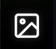

# เปิดภาพในโหมดเต็มหน้าจอ

<figure><figcaption>
ภาพที่เปิดในโหมดเต็มหน้าจอ พร้อมตัวเลือกลayer ที่มุมขวาบน
</figcaption></figure>

Chloros Image Viewer เป็นอินเทอร์เฟซแบบเต็มหน้าจอสำหรับการดู ตรวจสอบ และวัดภาพของคุณ นี่คือที่ที่คุณสามารถอ่าน **ค่าพิกเซลจริง** — DN ตามช่องสัญญาณ เปอร์เซ็นต์การสะท้อน หรือความสว่างในหน่วย W/m²/sr/nm — แทนที่จะเป็นภาพตัวอย่างที่ถูกยืดออกที่หน้าจอแสดงอยู่

## การเข้าถึง Image Viewer

### จาก **File Browser**

1. เปิดแท็บ**File Browser** 
2. คลิก **ภาพขนาดย่อ** ใดก็ได้ใน [ภาพกริด](image-grid.md)
3. ภาพจะเปิดในโหมดเต็มหน้าจอใน **Image Viewer** ภาพจะเปิดขึ้นบนผลิตภัณฑ์ใดก็ตามที่กริดกำลังแสดงอยู่ หากกริดถูกตั้งค่าเป็น `RAW (Reflectance)` นั่นคือชั้นที่คุณจะเข้าสู่

### การเปิดแถบด้านข้างของ **Image Viewer**คลิกไอคอน**Image Viewer**  ในแถบด้านซ้ายเพื่อเลื่อนแผงวิเคราะห์ออกมา ซึ่งประกอบด้วยข้อมูลจากบนลงล่างดังนี้:

* ชื่อภาพและรุ่นกล้อง
* ปุ่ม **Export/Save Image(s)**(ใช้ได้เฉพาะเมื่อ**Index**หรือ**LUT** กำลังทำงาน)
* ช่องทำเครื่องหมาย **Index**และ**LUT** พร้อมแผงการตั้งค่า Index — ดู [Index/LUT Sandbox](index-lut-sandbox.md)
* แผง **Cursor Values**: ค่าอ่านต่อช่องสัญญาณ, ฮิสโตแกรมของชั้นภาพ, และตัวควบคุม GSD***

## การนำทางและการซูม

### การดูภาพ

* **ภาพถัดไป**: ปุ่ม → หรือปุ่ม**→** (ลูกศรขวา)
* **ภาพก่อนหน้า**: ปุ่ม ← หรือปุ่ม**←** (ลูกศรซ้าย)
* **กระโดดไปยังภาพเฉพาะ**: กลับไปยังตารางและคลิกที่ภาพขนาดย่อ

การซูมและการเลื่อนจะคงอยู่ขณะที่คุณย้ายระหว่างภาพ ดังนั้นคุณจึงสามารถดูภาพในชุดได้ทีละภาพ โดยยังคงอยู่ในส่วนเดียวกันของเฟรม

### ซูม

การซูมถูกควบคุมโดย **ล้อเมาส์** ในขั้นละ 15% โดยยึดตามตำแหน่งของเคอร์เซอร์ — จุดที่อยู่ใต้ตัวชี้จะยังคงอยู่ใต้ตัวชี้ต่อไป ช่วงการซูมถูกจำกัดโดยขนาดภาพและขนาดหน้าต่าง: คุณไม่สามารถซูมออกจนเกินขนาดที่พอดีกับหน้าต่างได้ และขีดจำกัดด้านบนถูกกำหนดโดยความละเอียดดั้งเดิมของภาพ

ไม่มีปุ่มซูมเฉพาะในตัวดูภาพแบบเต็มหน้าจอ (ในโหมดกริด **Ctrl + `+` / `−`** ใช้เพื่อปรับขนาดภาพย่อ — ซึ่งเป็นระบบควบคุมที่ต่างกัน)

### การเลื่อนภาพขณะซูม

คลิกและกดปุ่มซ้ายของเมาส์ค้างไว้บนภาพแล้วลากไป การเลื่อนภาพถูกจำกัด ดังนั้นภาพจึงไม่สามารถลากออกนอกหน้าจอได้

### การตรวจสอบระดับพิกเซลต่อพิกเซลเมื่อซูมสูง

เมื่อการขยายภาพแบบ &quot;Effective&quot; เกิน **60×**, Chloros จะวาดกรอบไฮไลต์รอบพิกเซลที่แสดงอยู่ใต้เคอร์เซอร์ และแสดงค่าลอยอยู่ข้างๆ

การขยายภาพแบบ &quot;Effective&quot; นับตามขนาดบล็อก GSD: เมื่อขนาดบล็อกเป็น 8, กรอบเน้นจะปรากฏที่ระดับการซูม 7.5× แทนที่จะเป็น 60× เนื่องจากพิกเซลที่แสดงอยู่หนึ่งพิกเซลมีขนาดเท่ากับ 8 × 8 พิกเซลต้นทางแล้ว หากซูมกลับลงต่ำกว่าเกณฑ์ที่กำหนด กรอบเน้นจะหายไป

### คีย์ลัด

| ปุ่ม                             | ตำแหน่ง       | การดำเนินการ                              |
| ------------------------------- | ----------- | ----------------------------------- |
| **→**                           | หน้าจอเต็ม | ภาพถัดไป                          |
| **←**                           | หน้าจอเต็ม | ภาพก่อนหน้า                      |
| **Ctrl + R**                    | หน้าจอเต็ม | ตั้งค่าดัชนี/LUT sandbox ใหม่         |
| **Ctrl + `+`**/**Ctrl + `=`** | ตาราง        | ภาพตัวอย่างที่ใหญ่ขึ้น (4 px ต่อการกด)  |
| **Ctrl + `−`**                  | ตาราง        | ภาพตัวอย่างที่เล็กลง (4 px ต่อครั้งกด) |***

## ค่าของเคอร์เซอร์

นำเคอร์เซอร์ไปวางเหนือภาพ และแผง **ค่าของเคอร์เซอร์** จะแสดงค่าของทุกช่องที่อยู่ใต้เคอร์เซอร์


**นี่คือตัวเลขจริงของไฟล์** แคนวาสบนหน้าจอเป็นภาพตัวอย่างที่ถูกขยายแบบ 8 บิต และไม่สามารถแสดงค่าเหล่านี้ได้ ดังนั้นChlorosจึงสุ่มตัวอย่างจากไฟล์ผลิตภัณฑ์จริงเพื่อแสดงผล นั่นคือเหตุผลที่เฟรม raw 12-bit แสดงค่าที่สูงกว่า 255 และเหตุผลที่ชั้น radiance แบบ float32 แสดงหน่วยทางกายภาพ


### ความหมายของคอลัมน์

แผงข้อมูลจะปรับให้เหมาะสมกับชั้นข้อมูลที่คุณกำลังดู:

| ชั้นข้อมูลที่คุณกำลังดู              | คอลัมน์ที่แสดง    | หมายเหตุ                                                                                           |
| ---------------------------------- | ---------------- | ----------------------------------------------------------------------------------------------- |
| ค่าสะท้อน                        | **DN**และ**%** | เปอร์เซ็นต์ถูกคำนวณตามสเกลของไฟล์นั้นเอง — ดูด้านล่าง                                      |
| Radiance                           | **W/m²/sr/nm**   | ค่าทางกายภาพแบบ Float; ไม่มีคอลัมน์ DN เพราะ DN ไม่มีความหมายในที่นี้                           |
| Raw / Debayered / preview / JPG    | **DN**           | ตัวเลขดิจิทัลแบบจำนวนเต็ม                                                                         |
| การส่งออกค่าเปอร์เซ็นต์การสะท้อนแสงแบบ 32 บิต | **%** เท่านั้น       | ค่าทศนิยมที่เก็บไว้ไม่ใช่ DN ดังนั้นการปัดเศษให้เป็นจำนวนเต็มจะทำให้แสดงผลเป็น `0` หรือ `1` ซึ่งไม่มีความหมาย |

แต่ละแถวถูกระบุด้วยชื่อช่องของฟิลเตอร์กล้องของคุณ — `Red / Green / NIR` สำหรับRGN, `Orange / Cyan / NIR` สำหรับ OCN, `NIR / Green / Blue` สำหรับ NGB, `Red / Green / Blue` สำหรับ RGB, และชื่อแถบเดียวสำหรับกล้อง RE, NIR และกล้อง M3M แบบโมโนโครม แต่ละป้ายกำกับมีจุดสีที่ตรงกับวงกลมช่องสัญญาณที่ใช้ในตัวแก้ไขสูตรดัชนี

**ดัชนีและ LUT** ที่บันทึกไว้ เป็นกรณีพิเศษ: พวกมันเก็บส่วนประกอบแผนที่สีแทนที่จะเป็นแถบสเปกตรัม ดังนั้นแถวของพวกมันจึงถูกตั้งชื่อว่า `Red / Green / Blue` (หรือ `Index` สำหรับไฟล์ดัชนีช่องเดียว) แทนที่จะใช้ชื่อฟิลเตอร์ของกล้อง

เมื่อดัชนีถูกเปิดใช้งานในแซนด์บ็อกซ์ แถวเพิ่มเติมจะปรากฏขึ้นใต้ช่องแสดง **ค่าดัชนี** ที่ตำแหน่งเคอร์เซอร์ พร้อมด้วยชื่อดัชนีและจุดสีขาวที่ตรงกับเครื่องหมายบนฮิสโตแกรม

### เปอร์เซ็นต์การสะท้อนใช้สเกลเฉพาะของแต่ละไฟล์


**อย่าสมมติว่า 65535 = 100%** Chloros เก็บค่าการสะท้อนในสเกลที่แตกต่างกันขึ้นอยู่กับกล้องที่สร้างข้อมูลนั้น และโปรแกรมดูจะกำหนดสเกลที่ถูกต้องสำหรับแต่ละไฟล์


| แหล่งที่มา                  | DN ที่เท่ากับค่าสะท้อนแสง 1.0 | วิธีการระบุ                                                                                                                               |
| ----------------------- | ------------------------------ | -------------------------------------------------------------------------------------------------------------------------------------------------- |
| **LATTICE**(M3C / M3M) |**32768**                      | แท็ก XMP `Chloros:PixelScale=32768` ถูกเขียนลงในทุกไฟล์ส่งออกค่าสะท้อนแสงของ LATTICE ช่วง headroom 2× ช่วยให้ไฟล์สามารถเก็บค่า ρ ที่สูงกว่า 1.0 ได้โดยไม่เกิดการตัด |
| **Survey3**|**65535**                      | ไม่มีแท็กสเกล XMP ของ Chloros — การปรับเทียบ Survey3 จะเขียนค่า ρ × dtype-max และตัดค่าที่ 1.0                                                               |

โปรแกรมดู, พื้นที่ทดสอบ index/LUT และการส่งออก index ทั้งหมดใช้การปรับสเกลผ่านการดำเนินการเดียวกัน ดังนั้นค่าที่คุณอ่านได้ที่เคอร์เซอร์คือค่าเดียวกันกับที่การคำนวณ index ใช้

มีสองผลที่ควรทราบ:

* **เปอร์เซ็นต์ 32 บิต**TIFF เก็บ DN/65535 เป็น float และ**8 บิต** PNG /JPG export เก็บ DN × 255/65535 — โปรแกรมดูภาพจะแปลงทั้งสองค่ากลับก่อนแสดงเป็นเปอร์เซ็นต์
* มีกรณีหนึ่งที่ไม่อาจกู้คืนได้: **การส่งออก 8-bit TIFF ของภาพที่จับจากแหล่งที่มา 8-bit** จะถูกตัดให้อยู่ในช่วง 0–255 แทนที่จะปรับสเกลใหม่ และไม่มีการใส่แท็กสเกลโดยเจตนา สำหรับไฟล์เหล่านี้ แผงควบคุมจะแสดงผลเฉพาะค่า DN เท่านั้น โดยไม่มีคอลัมน์เปอร์เซ็นต์ นี่คือคำตอบที่ถูกต้อง ไม่ใช่ข้อผิดพลาด***

## ฮิสโตแกรมของเลเยอร์

ใต้แถวเคอร์เซอร์คือฮิสโตแกรมแบบเรียลไทม์ของเลเยอร์ที่คุณกำลังดูอยู่ ใน **256 บิน**ตามค่าเริ่มต้น มันจะวาดเส้นโค้งรวมหนึ่งเส้น ที่ถ่วงน้ำหนักด้วย `(R + 2G + B) / 4` — ซึ่งเป็นพื้นที่การวัดเดียวกันกับที่ฮิสโตแกรมของกล้อง LATTICE ใช้ เมื่อเปิด**RGB** จะเปลี่ยนเป็นเส้นโค้งแยกตามช่องสัญญาณในสีของช่องสัญญาณนั้น ๆ โดยผสมแบบเพิ่มกันเพื่อให้ส่วนที่ทับซ้อนกันยังคงอ่านได้ ชั้นภาพโมโนโครมจะวาดเส้นโค้งเดียวเสมอ

แกนแนวนอนใช้หน่วยของเลเยอร์นั้นเอง:

| เลเยอร์       | หน่วยแกน  | ค่าสูงสุดของแกน                                               |
| ----------- | ---------- | ---------------------------------------------------------- |
| Reflectance | percent    | 125% — พื้นที่ว่างของผลิตภัณฑ์อนุญาตให้ ρ สูงกว่า 1.0           |
| Radiance    | W/m²/sr/nm | ค่าสูงสุดของเฟรมเอง ปัดขึ้นเป็นสองหลักสำคัญ |
| ข้อมูล 8 บิต  | DN         | 255                                                        |
| ข้อมูล 12-bit data | DN         | 4095                                                       |
| 16-bit data | DN         | 65535                                                      |

เมื่อแกนอยู่ในหน่วย DN และอยู่ที่หนึ่งในสามขีดจำกัดดังกล่าวChloros จะทราบความลึกของบิตของภาพที่คุณกำลังดูอยู่ด้วย

มีปุ่มสามปุ่มอยู่ด้านบนของฮิสโตแกรม|
| ปุ่ม     | ค่าเริ่มต้น | ผล                                                                                                                                                                                                                                                                                   |
| ---------- | ------- | ---------------------------------------------------------------------------------------------------------------------------------------------------------------------------------------------------------------------------------------------------------------------------------------- |
| **CURSOR** | เปิด      | วาดเส้นเครื่องหมายบนฮิสโตแกรมที่ค่าที่แสดงในแถวด้านบนอย่างแม่นยำ เพื่อให้คุณเห็นตำแหน่งของพิกเซลใต้เคอร์เซอร์ในความกระจายของเฟรม ในโหมดRGB จะมีเครื่องหมายหนึ่งตัวต่อช่องสัญญาณด้วยสีเฉพาะของแต่ละช่องสัญญาณ; ในกรณีอื่นจะมีเครื่องหมายสีขาวเดียวที่ค่ารวม |
| **INDEX**| เปิด      | ปรากฏเฉพาะเมื่อดัชนีกำลังใช้งานอยู่ เปลี่ยนฮิสโตแกรมจากแถบแหล่งที่มาเป็น**การแจกแจงค่าดัชนี** โดยแสดงขีดจำกัดคลิปทั้งสองเป็นเส้นประสีส้ม และค่าดัชนีของเคอร์เซอร์เป็นเส้นสีขาว                                                          |
| **RGB**| ปิด     | เปลี่ยนจากเส้นโค้งรวมเป็นเส้นโค้งแยกตามช่องสัญญาณ สำหรับเซ็นเซอร์โมโน ปุ่มนี้จะแสดง**MONO** และถูกปิดใช้งาน — มีเพียงช่องสัญญาณเดียวที่จะแสดง                                                                                                                                  |

ฮิสโตแกรมถูกคำนวณจาก **บล็อกที่คุณเห็น** ไม่ใช่พิกเซลต้นทางที่อยู่เบื้องหลัง: เมื่อเปลี่ยนขนาดบล็อก GSD การแจกแจงจะคำนวณใหม่ ทำให้ฮิสโตแกรม ตัวชี้เคอร์เซอร์ และภาพที่แสดงอยู่ตรงกันเสมอ***

## ขนาดบล็อก GSD

ที่ด้านล่างของแผงควบคุมมีตัวควบคุม **GSD (px)**: กล่องตัวเลข, ตัวเลื่อนจาก**1 ถึง 256**, และปุ่ม**RESET**.

มันจะทำให้ภาพที่ _แสดง_ ดูหยาบขึ้น โดยการเฉลี่ยบล็อก N × N ของพิกเซลต้นทางเป็นพิกเซลที่แสดงเพียงหนึ่งพิกเซล `1` คือความละเอียดดั้งเดิม

* มันส่งผลต่อ **โหมดดูเต็มหน้าจอ, ภาพย่อแบบกริด, การแสดงค่าของเคอร์เซอร์ และฮิสโตแกรมทั้งสอง** — ทุกสิ่งที่แสดงภาพจะมีความละเอียดพื้นฐานเดียวกัน
* มันเป็น **การแสดงผลเท่านั้น** การประมวลผลและการส่งออกไม่ได้รับผลกระทบ ยกเว้นกรณีเดียวที่ตั้งใจไว้: การส่งออกผ่าน [Index/LUT Sandbox](index-lut-sandbox.md) จะบันทึกภาพที่คุณกำลังดูอยู่ ดังนั้นจึงนำขนาดบล็อกปัจจุบันไปด้วย, และแผงส่งออกจะแจ้งเตือนคุณเมื่อขนาดบล็อกเกิน 1
* ค่านี้ถูกเก็บ **ตามโครงการ** ในรูปแบบ `viewer_display.gsd_bin` ภายใน `project.json` ดังนั้นจึงยังคงอยู่แม้ปิดและเปิดโปรแกรมใหม่
* การแสดงผลของเคอร์เซอร์จะรายงานค่าของบล็อก ไม่ใช่พิกเซลต้นทาง เมื่อขนาดบล็อกเกิน 1 — ค่าที่แสดงคือค่าเฉลี่ยของบล็อกที่อยู่ใต้เคอร์เซอร์ของคุณ


**ทำไมถึงใช้ &quot;ขนาดบล็อก&quot; แทนที่จะเป็นเซนติเมตรต่อพิกเซล?** ค่า cm/px จำเป็นต้องมีความสูงเหนือพื้นดิน ข้อมูล EXIF ของเฟรมเดียวมีข้อมูลความสูง GPS เหนือระดับน้ำทะเลเฉลี่ย ไม่ใช่เหนือพื้นดินที่กล้องชี้ไป ดังนั้น Chloros จึงไม่แสดงระยะทางจากพื้นดินที่มันไม่สามารถคำนวณได้อย่างถูกต้อง ขนาดบล็อกในพิกเซลต้นทางเป็นวิธีการสำรองเดียวกันที่เครื่องมือบนคลาวด์ของ MAPIR ใช้เมื่อระยะตัวอย่างพื้นดินไม่ทราบ


***

## ประเภทภาพที่คุณสามารถดูได้

เมนูแบบเลื่อนลงของเลเยอร์ที่มุมขวาบนของโปรแกรมดูภาพจะแสดงรายการทุกเวอร์ชันของภาพปัจจุบัน รายการที่ปรากฏขึ้นขึ้นอยู่กับกล้องและสิ่งที่ได้รับการประมวลผลแล้ว — ดู [เลเยอร์ภาพ](image-layers.md) เพื่อดูรายการเต็มและวิธีการทำงานของเมนูแบบเลื่อนลง

### Survey3

* **JPG** — ไฟล์ตัวอย่างจากกล้องเอง
* **RAW (Original)** — ไฟล์ต้นทาง `.RAW` ที่ได้ทำการ debayering เพื่อแสดงผล โดยไม่มีการปรับแก้ใดๆ
* **RAW (Target)** — เฟรมที่ระบุว่ามีเป้าหมายการปรับเทียบ
* **RAW (Reflectance)** — ผลลัพธ์การสะท้อนแสงที่ได้รับการปรับเทียบ (65535 = ρ 1.0)
* **Vignette Corrected**/**Sensor Response** — ผลลัพธ์สำรองที่ยังไม่ได้รับการปรับเทียบ
* **White Balanced** — ผลลัพธ์ที่ปรับสมดุลสีขาวแล้ว
* **RAW (`<INDEX>` Index)**และ**`<INDEX>` LUT** — ภาพดัชนีที่คำนวณได้

### LATTICE

การจับภาพ LATTICE ใช้เมนูแบบเลื่อนลงเดียวกัน พร้อมชื่อระดับของ pipeline:

| Layer                 | เนื้อหาที่เก็บ                                                        |
| --------------------- | -------------------------------------------------------------------- |
| **RAW (Original)**    | เฟรม RAW แหล่งที่มาตามที่ถูกจับภาพ                                     |
| **RAW (Debayered)**   | ภาพที่ผ่านการถอดเบย์เออร์แบบเชิงเส้น                                           |
| **RAW (Preview)**     | ภาพตัวอย่างที่แสดง — การขยายสีเทียมสำหรับกล้องมัลติสเปกตรัม |
| **White Balanced**    | ภาพตัวอย่างที่แสดงสำหรับกล้องหลักRGB (การปรับสมดุลสีขาว + แกมมา)   |
| **RAW (Radiance)**    | ค่าความส่องสว่างเชิงสเปกตรัมแบบ Float32 ในหน่วย W/m²/sr/nm                              |
| **RAW (Reflectance)** | ค่าการสะท้อนแบบ uint16, 32768 = ρ 1.0                                    |

ความส่องสว่างและความสะท้อนมีเฉพาะในโหมดมัลติสเปกตรัมเท่านั้น: กล้องหลักแบบRGBไม่มีการวัดรังสีตามแต่ละแถบ จึงไม่มีการสร้างชั้นข้อมูลดังกล่าวสำหรับกล้องนี้

***

## การใช้ดัชนีและตารางค้นหาสี (LUT)

ใช้ดัชนีมัลติสเปกตรัมและตารางค้นหาสี (LUT) จากแถบด้านข้าง:

1. เปิด **Image Viewer**  ในแถบด้านข้าง
2. ทำเครื่องหมายที่ **Index**

3. เลือกฟิลเตอร์ของกล้องและสูตรดัชนี แล้วลากวงกลมช่องสัญญาณไปยังช่องของสูตร
4. เพิ่ม LUT และเลือกการไล่ระดับสี ค่าเกณฑ์ และโหมดการตัด
5. อ่านค่าที่ตำแหน่งเคอร์เซอร์ และบันทึกผลลัพธ์ด้วย **Export/Save Image(s)**ดู [Index/LUT Sandbox](index-lut-sandbox.md) เพื่อดูขั้นตอนการดำเนินการอย่างละเอียด***

## การแก้ไขปัญหา

### ภาพไม่เปิดได้

**สาเหตุที่อาจเกิดขึ้น**: ไฟล์ถูกย้ายหรือลบหลังจากนำเข้า; ผลิตภัณฑ์ไม่ถูกบันทึก; หน่วยความจำไม่เพียงพอสำหรับภาพที่มีขนาดใหญ่มาก**วิธีแก้ไข**:

1. ตรวจสอบว่าไฟล์ของเลเยอร์ยังคงอยู่ในโครงสร้างผลลัพธ์ของโครงการ
2. เปิดไฟล์ในโปรแกรมดูภาพภายนอกเพื่อยืนยันว่าไฟล์ยังสมบูรณ์
3. ปิดแอปพลิเคชันอื่น ๆ เพื่อเพิ่มพื้นที่หน่วยความจำ

### ภาพเป็นสีดำ สีขาว หรือมีสีผิดปกติ

**สาเหตุที่อาจเกิดขึ้น**: การขยายภาพไม่มีข้อมูลให้ทำงาน (เฟรมที่เกือบคงที่); เลเยอร์ float32 ที่มีค่าผิดปกติ; ดัชนีที่สร้างข้อมูลไม่ถูกต้อง**วิธีแก้ไข**:

1. ตรวจสอบค่าของเคอร์เซอร์ — หากทุกช่องมีค่าเป็นศูนย์หรือใกล้ศูนย์ ปัญหาอยู่ที่ข้อมูล ไม่ใช่ที่การแสดงผล
2. ตรวจสอบฮิสโตแกรม: จุดสูงสุดเพียงจุดเดียวที่ปลายด้านใดด้านหนึ่งบ่งชี้ว่าเฟรมถูกตัดหรือว่างเปล่า
3. ตรวจสอบบันทึกการประมวลผล (processing log) ของการรันที่สร้างเลเยอร์ดังกล่าว

### ค่าดูผิด

**สาเหตุที่อาจเกิดขึ้น**: คุณกำลังใช้เลเยอร์ที่ต่างจากที่คุณคิด; คุณกำลังเปรียบเทียบค่าเปอร์เซ็นต์กับค่า DN ดิบ; คุณกำลังเปรียบเทียบไฟล์ LATTICE กับไฟล์ Survey3 โดยใช้ตัวหารเดียวกัน**วิธีแก้ไข**:

1. ตรวจสอบชั้นที่เลือกในเมนูแบบเลื่อนลง — หน่วยของแผงจะตามชั้นที่เลือก
2. สำหรับค่าสะท้อนแสง ให้ใช้คอลัมน์ **%** แทนที่จะหารค่า DN ด้วยตัวเอง; หากจำเป็นต้องหาร ให้ใช้ค่า `Chloros:PixelScale` ของไฟล์นั้น (32768 สำหรับ LATTICE, หากไม่มีค่านี้ หมายถึง 65535 สำหรับ Survey3)
3. ตั้งค่าขนาดบล็อก GSD กลับเป็น 1 — หากตั้งค่าเกิน 1 คุณกำลังอ่านค่าเฉลี่ยของบล็อก ไม่ใช่ค่าพิกเซล
4. ตรวจสอบว่าการปรับเทียบการสะท้อนแสงได้ดำเนินการจริงสำหรับเฟรมนั้นหรือไม่; ผลิตภัณฑ์สำรองที่ยังไม่ได้รับการปรับเทียบ (Sensor Response / Vignette Corrected) ไม่ใช่การสะท้อนแสง

***

## ขั้นตอนต่อไป

* [**ชั้นภาพ**](image-layers.md) — ชื่อชั้นภาพทุกชั้น (หากมี) และความหมายของค่าในชั้นนั้น
* [**พื้นที่ทดลองดัชนี/LUT**](index-lut-sandbox.md) — สร้าง ปรับแต่ง และส่งออกการแสดงผลดัชนี
* [**เครื่องหมายบนแผนที่**](map-markers.md) — ชุดภาพเดียวกันบนแผนที่
* [**สูตรดัชนีมัลติสเปกตรัม**](../project-settings/multispectral-index-formulas.md) — เอกสารอ้างอิงดัชนี

สำหรับขั้นตอนการทำงานในการประมวลผล ดูที่ [การประมวลผลภาพ (GUI)](../processing-images-gui/adding-files-to-a-project.md).
